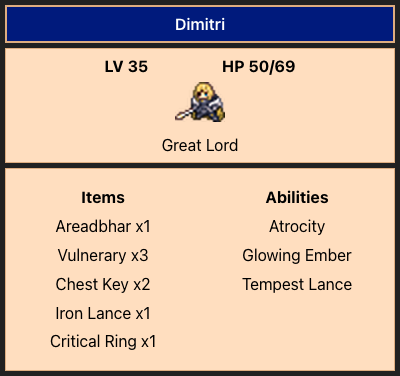

## 🌟 [Exercise 1] Character Card 💙
- Exercise directory: `/src/exercises/1-character-card/`
- Display exercise: http://localhost:5173/exercise1
- Sample answer: `/src/answers/1-character-card`
- Display sample answer: http://localhost:5173/answers/exercise1

## Task
You are given the `character` object inside `CharacterCard.jsx`. Your task is to use markup and javascript to recreate the following player profile card. 

You may need to create and import your own css file in order to style some elements to make it match the result.

Don't worry if your styling isn't super on point (esp during the workshop, just at least display the data), though it would be a good idea to get some practice in!

    
Hint 1

    Whenever we want to group some divs/elements together, we can wrap them with a parent div! For example:
    
    

        
Wow I am a child!

        
Wow I am a child!

        
Wow I am a child!

        
Wow I am a child!

    

